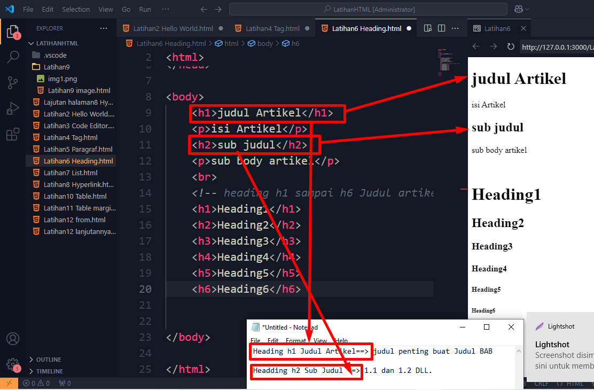

## HTML

## 1. Latihan Hello World

## 2. Lanjutan Hello World

## 3. Lanjutan Tag

## 4. Latihan Paragraf

## 5. Latihan Heading

## 6. Latihan List

## 7. Latihan Hyperlink & Lajutan halaman8 Hyperlink

## 8. Latihan image

## 9. Latihan Table

## 10. Latihan11 Table margin

## 11. Latihan12 from

## 12. Latihan13 from lanjutan

